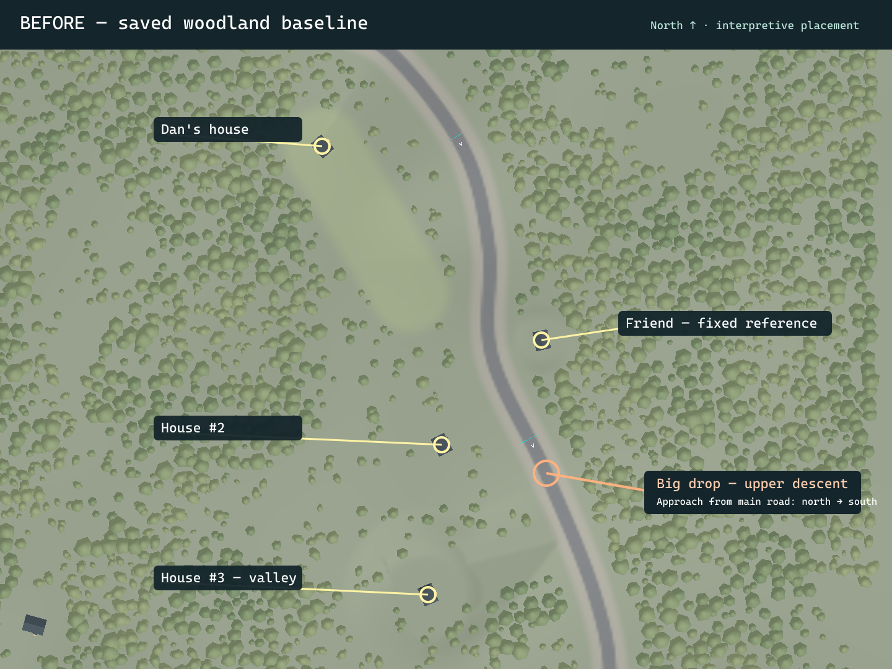
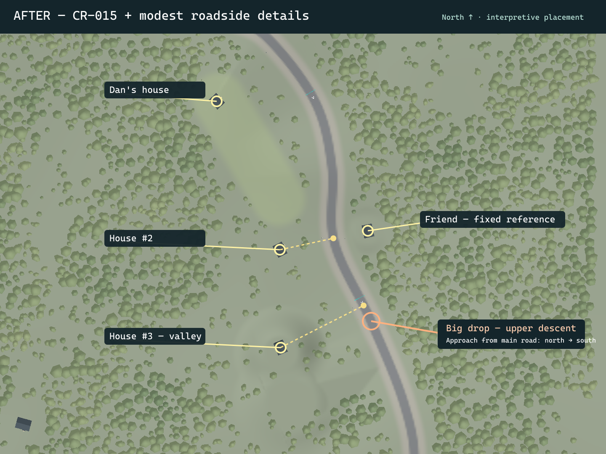

# CR-015 and the focused roadside-detail batch

Implemented, awaiting Dan's visual approval. Phase 6 remains incomplete; no other Phase 6 category or Phase 7 was started. Earlier building, driving, race and shortcut approvals remain intact. Dan's report that woodland coverage is much better is recorded as positive coverage feedback, not approval of every off-road or performance test.

Safety checkpoint: `a1212eca4712a7b9c0f26da495857ac58abbe2dc`. The initial `git add -A` failed with permission denied creating `.git/index.lock`. The elevated retry committed the saved TODO changes before any project edits. Completion commit is reported in the task response.

Open `Assets/Scenes/StreetLoopGreybox.unity`.

## Placement evidence

The annotated reference in `Docs/References/area_map_annotated.jpg`, scene labels, saved transforms and the route spline established the identities. The second yellow circle corresponds to the strong descent after route knot `(514.8,82,-132)`, approaching southward from the main road. Coordinates and distances are interpretive Unity metres, not surveyed measurements.

The dashed links in the after overview connect Houses #2/#3 to their nearest road points. This matters on the curving road: House #3's nearest road point is **before** the drop even though the house itself lies southwest, down in the valley. The friend's house stays fixed.

| Site | Before XYZ | After XYZ | Offset XYZ | Root-to-road-center setback before → after |
|---|---|---|---|---|
| Dan | 352.000, 74.986, 105.600 | 349.781, 74.970, 103.581 | -2.219, -0.016, -2.019 | 83.123 → 86.123 m |
| House #2 | 438.900, 85.374, -111.100 | 417.409, 85.647, -55.317 | -21.491, +0.272, +55.783 | 58.367 → 58.367 m |
| Friend | 511.500, 84.866, -35.200 | unchanged | 0, 0, 0 | 37.850 → 37.850 m |
| House #3 | 429.000, 32.755, -220.000 | 418.000, 32.755, -160.000 | -11.000, 0.000, +60.000 | 113.545 → 99.523 m |

Setbacks are horizontal distances from the house root, **not facade clearances**. For distance from the root to the nominal 4.5 m asphalt edge, subtract 4.5 m: Dan 78.623→81.623; #2 53.867→53.867; friend 33.350 unchanged; #3 109.045→95.023. Source measurements: [before](before-sites.json), [after](after-sites.json).

Dan moves exactly 3 m farther from the road. House #2 retains its setback and moves about 59.8 m toward Dan onto the perpendicular through the friend's road projection. Cross-street line error and road-projection separation are below 0.001 m. This is geometric alignment within the approximate map, not historical precision.

House #3 moves about 61 m horizontally toward #2. Its nearest road point has Z=-115.047, about 17 m north of the strong-descent knot at Z=-132. Its ground stays Y=32.755, now 53.071 m below the nearby crest road. It is not raised onto the road. House #1 remains absent; #2/#3 are not renumbered. Rotations, prefab designs and architectural dimensions remain accepted versions.

## Local terrain, access, trees and authoring

- Extended the existing low valley bowl locally toward the moved House #3. One terrain tile changes: `Ground_560_240.asset`, 1,824 unique vertices, within 52 m of `(418,-166)`. Maximum lowering is **42.881 m**. This is a pronounced local valley extension needed to keep the house at its old low elevation; Dan should review its hillside appearance. No terrain was raised. Road and ordinary shoulder terrain within 18 m of the road center is untouched.
- Foundations and simple collision follow the three moved houses. Entrance steps were regrounded; the new local foundation tops do not bury the accepted architecture. All 47 buildings' foundation corners passed support checks.
- Nine original trees conflicting with corrected footprints/crown clearances were removed, retaining **11,888 of 11,897 trees (99.92%)**. Eighteen local trunks were initially regrounded on the changed tile; two of those were subsequently removed in the final clearance pass, leaving 16 moved surviving trunks. No broad woodland clearing or new prescribed forest corridors.
- Two forest batches have changed visible geometry. The other **88 batches have exactly identical vertex positions, normals, colors and triangle indices** to the safety checkpoint. Refresh also reserialized unused UV/tangent buffers in some assets; these are not woodland placement changes. [Mesh comparison](forest-geometry-preservation.json).
- The expanded yard remains the original protected capsule, including the former House #1 site. House #3's existing southern valley approach remains usable; the steep northern hillside is not advertised as universally drivable. Its near-site access was driven both ways.
- Four reusable low-poly mailboxes and two simple ochre bend signs use the accepted building palette. No personal names, addresses, claimed historical accuracy, fences, destruction, lights or audio. Minimum prop root distance from the road center is 11.942 m, outside the 9 m normal shoulder envelope. Small props intentionally have **no colliders**, so they cannot launch or trap the car; this is a deliberate pass-through collision policy, not a destruction system.
- `CR015Neighborhood` is a guarded, focused one-time authoring operation; it refuses to reapply to the completed scene. `Assets/Buildings/Roadside/House placements.json` records final authored placements for future deliberate work. Legacy house-generation entry points consult that data; CR-014's site/sightline exclusion uses the current/authored House #3 location. Existing full-rebuild guards remain; **the legacy whole-environment rebuild was not run**. Building/forest visual refreshes keep authored transforms.
- Fixed stale building GPU buffers in `Phase6Buildings.RefreshVisualBatches()` by explicitly replacing/uploading vertex/index data. Initial after captures exposed old visible positions while colliders had moved; final captures and reload show corrected positions. No architectural redesign.

Views: [Dan](after-dan.png), [House #2](after-house2.png), [friend](after-friend.png), [House #3](after-house3.png), [paired mailboxes from driving height](after-mailbox-driving-camera.png), [drop camera](after-drive-drop.png), [Dan road camera](after-drive-dan.png). Roadside reviews use the game camera at driving-height positions; dynamic camera behavior was also exercised during the drives below.

## Actual checks

[Geometry checks](geometry.txt): all passed. Exact across-street alignment; House #3 before-drop road projection and valley height; all 47 foundations grounded; zero terrain height/normal seam mismatches; shared visible/collision terrain mesh; 1,499 unobstructed expanded-yard support probes; House #1 absent; six roadside props outside ordinary shoulders; no unsupported local tree bases. Sampling is not an exhaustive collision proof.

Approved car, ordinary Update/FixedUpdate and virtual Gamepad, initial placement only teleported:

| Drive | Coverage/result |
|---|---|
| Affected neighborhood road | Two before and two after 30 s runs, approximately 447 m each at 15 m/s target; minimum upright 0.880, maximum path error ≤1.80 m. Includes the big descent. |
| Expanded yard | 99.7 m, peak 5.48 m/s, minimum upright 0.985, max path error 2.22 m. |
| House #2 access and shoulder re-entry | 60.6 m, peak 4.50 m/s, upright 0.946, max error 2.86 m. |
| Valley access | 67.0 m, peak 4.45 m/s, upright 0.925, max error 2.35 m. |
| Valley return | 64.8 m, peak 5.04 m/s, upright 0.908, max error 1.58 m. |
| Jump from rest | 31.79 m/s takeoff, 1.74 s airborne, landed upright; minimum upright 0.981. |
| Shortcut | Reached exit in 9.43 s, peak 24.32 m/s, max error 2.90 m, upright 1.000; camera/HUD active. This established harness injects initial 24 m/s velocity. |

Raw [access drives](access-driving.csv), [jump](jump-ordinary-result.txt), [shortcut](shortcut-ordinary.txt). Near-house woodland and valley gaps were traversed; not every tree gap or steep slope was tested. No physical controller was tested.

Existing manually stepped PhysX regression harnesses also passed: [three mixed normal/shortcut laps](MIXED_LAPS.txt), 551.52 s simulated total, mean 25.42 m/s, peak 39.71; [race/input/HUD/reset/restart](RACE_REGRESSION.txt), zero failures; [shortcut recovery](RECOVERY.txt); [jump/bypass/shoulder matrix](JUMP_TESTS.txt). Prior fast negative-angle jump cases remain marked LIMIT (lateral deviation), not newly claimed passes. These are simulated driving checks, not physical-controller or subjective approval.

## Performance and limitations

Matched Editor conditions: Unity 6000.6.1f1, D3D11, GTX 1660 Ti, i7-9700, PC quality, 734×293 Game view, vSync 0, unlimited target, 0.02 s physics. Same car route, speed, camera, forest, 3 s warmup + 27 s measured per run. [Before](profile-before.csv), [after](profile-after.csv), [final repeat](profile-after-repeat.csv).

Initial before medians **7.97 / 6.44 ms**, p95 **24.84 / 21.12 ms**; after medians **7.32 / 9.30 ms**, p95 **23.63 / 37.62 ms**. Worst before 106.8 ms versus after 206.5 ms. Editor allocated memory rose about 1,697→1,742 MiB following authoring/imports; this is not a standalone-player allocation measurement. Larger spikes remain unresolved; no performance parity, speedup, target frame rate, GPU timing or controlled host-load result is claimed. Access-drive timings include concurrent evidence work and are not additional matched performance comparisons. No new standalone build or representative full-resolution benchmark was run for this small batch; CR-014's earlier standalone results remain historical only.

The final two after repeats measured medians **7.73 / 11.73 ms**, p95 **18.24 / 23.52 ms**, and a worst spike of **252.9 ms**. No concurrent heavy evidence processing was scheduled during these repeats. The variability and spikes remain; they cannot be attributed confidently to this small prop batch from these Editor measurements.

[Final compilation](compilation-final.json) completed successfully with no compile errors. [Save/reload](save-reload.json) confirms the correct scene outside Play mode, not dirty, with 11,888 trees and six props. [Final live Console](console-final.json): **0 errors, 0 warnings**, after archiving [tooling history](console-history.json). CLI five-second timeouts occurred during refresh/authoring operations that completed afterward; output files and live state were checked before proceeding, rather than blindly reapplying. An initial evaluator syntax error and a premature call before compilation completed affected inspection tooling only. Console history is retained separately from the final live error count.

Changed-file inventory: [files-changed.txt](files-changed.txt). Principal changes are the scene, one terrain tile, generated building/forest meshes, two roadside prefabs and placement JSON, focused authoring/generation scripts, project TODO, and this evidence directory. Vehicle, camera, controls, reset, race, jump and shortcut implementation files are unchanged.

## Dan's review

- Check the small extra setback and intact expanded yard at Dan's house.
- Confirm House #2 belongs directly opposite the fixed friend's house.
- Judge House #3's before-drop location and pronounced low valley/hillside; drive its southern access both ways.
- Check mailbox/sign scale and readability while driving, normal shoulder re-entry, and continued freedom between trees.
- Drive a normal lap, shortcut and jump/bypass; judge smoothness at your usual resolution and with your controller.

CR-015 and this roadside-detail batch remain awaiting that visual review. CR-013 photos remain optional backlog.
