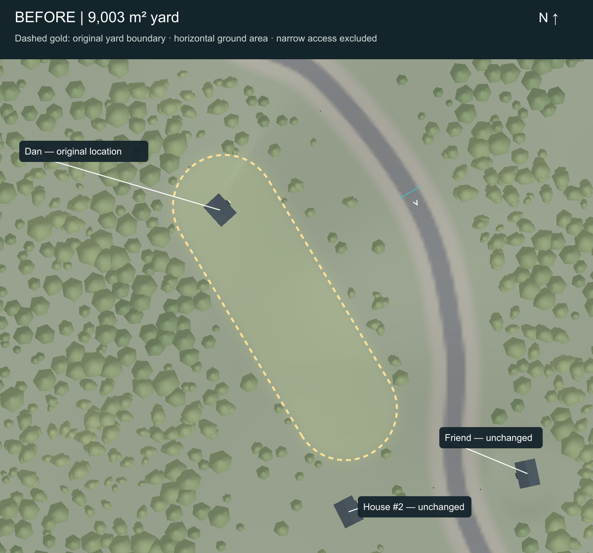
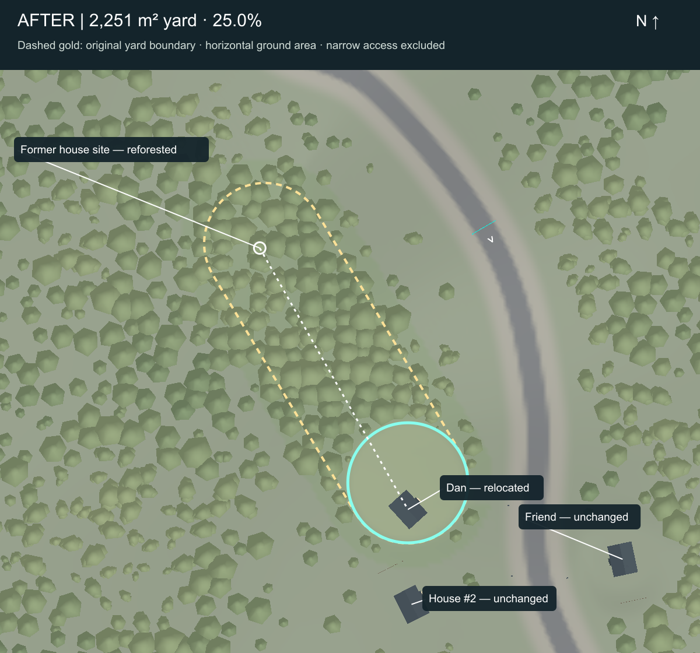

# CR-016 / CR-017 integrated Phase 6 batch

Implemented for Dan's review. Phase 6 remains incomplete. This batch combines the house/yard correction, restrained fences and reusable breakable roadside props. CR-013 remains optional backlog.

Safety checkpoint: `1f90aedb9db6bf6a053f2dc540682689a411e53a`. Git staging initially failed creating `.git/index.lock`; the authorized elevated retry succeeded before project modifications. Completion commit is reported in the task response.

Open `Assets/Scenes/StreetLoopGreybox.unity`. Review build: `Builds/CR016-017/Racer.exe` (local generated build, excluded from Git).

## House, yard and forest

The annotated reference and `StreetLoopBuilder.P` establish X east and Z north: reference image Y increases southward, and scene Z is `(950-y)*1.1`. This is interpretive mapping, not a surveyed reconstruction.

| Measurement | Before | After |
|---|---:|---:|
| House XYZ, metres | 349.7807, 74.9703, 103.5814 | 415.8000, 83.8196, -13.0000 |
| Yard horizontal area | 9,003.472 m² | 2,250.869 m² |
| Yard footprint | Radius-27 capsule from (352,105.6) to (415.8,-1.1) | Radius-26.76703 clearing centered (415.8,-1.1) |
| Southern boundary Z | -28.100 | -27.867 |
| Tree count | 11,888 | 11,995 |

The house moves **116.581 m south**, 66.019 m east and 8.849 m upward onto the existing terrain. Its root is 15.1 m north of the old yard's southernmost point. Yard area is **25.000%**, not 25% in each dimension. The boundary records the protected clearing; softened terrain colors and irregular woodland edges make the visible transition less exact. Narrow road access is separate from the yard-area measurement.

Accepted architecture and orientation are retained. Foundation floor is 84.889 m; support extends to 82.708 m. Steps meet the existing ground. No terrain excavation: all 100 ground meshes retain identical vertex positions, normals and indices. Only three local ground color assets change. All 46 other buildings retain their positions and rotations, including Houses #2/#3 and the friend; House #1 remains absent.

**107 added solid trunks** fill the released northern clearing, retaining every prior tree. Minimum added-to-any-trunk center spacing is **6.803 m**; new trunks are 0.75 m wide. Crowns use the existing faceted woodland assets. Two local forest batches change visible geometry; the other 88 retain identical positions, normals, colors and indices. Some unused buffers reserialize during refresh. The compact yard and a six-metre-half-width tree exclusion along access remain clear; crown clearance retains an approximately seven-metre-wide access opening.

Placement JSON, `CompactYard`, yard exclusions and crown limits preserve the correction during later deliberate generation/visual refreshes. The saved trunk colliders remain the forest authoring data. No legacy whole-environment rebuild was run.

## Fences and breakable props

Eighteen assemblies:

- Four existing mailboxes. Dan's moves to **(460.483,83.209,-11.301)** beside the relocated access. Others remain at their prior sites.
- Two accepted bend-warning signs, near **(309.105,71.146,299.259)** and **(500.652,83.605,-129.808)**.
- Jump approach board at **(-634.569,7.581,-146.132)** and two shortcut advice boards at **(-532.099,6.554,-541.072)** / **(-610.985,6.232,-468.531)**. Their lettering falls with each board. Checkpoint gates and HUD are unchanged.
- Nine lightweight two-rail timber fence sections: three on Dan's western yard edge around **(390,83,-1)**, three beside House #2 around **(408,85,-39)**, and three beside the friend's property around **(516,86,-54)**. These are approximate dressing, not historical claims or perimeter barriers. Front approaches remain open. Low post bottoms extend locally to meet slopes.

`BreakableProp` uses a box **trigger** and a 0.2 m/s contact threshold. It visibly knocks the original assembly aside; no solid obstacle impulse is applied to the car. The original mesh is the fragment: no repeated cloning and no debris rigidbodies. One break per restoration cycle, immediately disabled trigger, at most **24 moving assemblies globally**, four-second debris lifetime with a short final shrink, then hidden visuals. Therefore debris cannot block road access or interact with suspension. This is deliberately simple yielding scenery rather than a physically fractured simulation.

Race restart first resets the car/progress, then clears old debris and restores props. Original bounds overlapping a vehicle defer restoration, remaining invisible and noncolliding until clear. Scene reload restores authored intact state. Ordinary vehicle reset does not restore broken props and retains the existing race invalidation rules. Approved vehicle tuning, input, camera, HUD, gates and progress logic are unchanged; `RaceDirector` gains only the restoration call in `RestartRace`.

## Validation

[Geometry](geometry.txt): zero failures. [Mesh comparison](mesh-preservation.json) verifies unchanged terrain geometry and retained remote forest geometry. [Prop inventory](props.json) lists every location.

[Ordinary-frame impact tests](impacts.txt): **20/20** centered/glancing cases at 3 and 30 m/s across a mailbox, bend sign, fence, shortcut sign and jump sign. Each broke exactly once and disabled its trigger; all stayed upright and credited zero laps. Three consecutive Dan fence sections also broke during one drive. Eight synthetic contact bursts exercised all 18 props; repeated contacts did not spawn debris. Cleanup after 4.5 seconds left zero moving fragments and hidden broken visuals. Five race restarts restored visual/sensor agreement. Ordinary reset retained broken state; overlapping restoration deferred correctly and completed after the car vacated. These are virtual Gamepad tests with initial pose/velocity injected, not physical-controller testing.

The impact test includes terrain-induced vertical motion (up to 7.91 m/s on the sloped bend-sign approach); a trigger-only prop supplies no solver impulse. No claim that all terrain approaches are flat or universally launch-free.

[Sloped surface-area estimate](surface-areas.txt): triangle-centroid sampling on unchanged 2 m terrain gives approximately **9,070.2→2,281.4 m² (25.15%)**. Boundary sampling explains the slight difference from exact horizontal area.

[Local drives](local-driving.csv), ordinary frames and virtual Gamepad: 119.8 m through new woodland, peak 3.92 m/s, minimum upright 0.991 and maximum path error 2.43 m. House access out/in covered 46.7/47.9 m, peak 4.41 m/s, upright 0.980/0.979. The follower overshot the route endpoint while stopping, producing maximum endpoint errors of 7.07/6.40 m; no claim of exact stopping precision. Not every gap or hillside was traversed.

[Mixed laps](mixed-laps.txt): three shortcut/normal/shortcut laps completed, 551.52 s simulated, mean 25.42 m/s, peak 39.71, maximum path error 3.23 m and minimum upright 0.880. [Race regression](race-regression.txt): zero failures across checkpoint validation, timing, virtual input, HUD, reset/restart and three real-PhysX laps. [Jump/bypass/shoulders](jump-tests.txt): accepted cases passed; pre-existing 42/46 m/s negative-angle approaches retain LIMIT labels for 8.46/9.33 m lateral deviation. These regression harnesses manually step PhysX; they are not ordinary-frame or physical-controller measurements.

[Debris cap](debris-cap.txt): 35 simultaneous temporary assemblies produced at most 24 moving visuals, immediately retired the oldest 11, added no rigidbodies and cleaned fully after 4.5 seconds. The temporary clones belong only to this test; production impacts never instantiate clones.

Visual-state evidence: [intact fences](fences-intact.png), [yielding fences](fences-yielding.png). Those two captures use a controlled yield dispatch for a matched view; the 20 impact cases above use real vehicle/trigger contacts.

## Performance and build

Matched Editor road conditions: Unity 6000.6.1f1, i7-9700, GTX 1660 Ti, D3D11, PC quality, 734×293, vSync 0, unlimited target, 0.02 s physics, same route and camera, 3 s warmup plus 27 s measured, two runs each.

| Road timing | Before runs | After runs |
|---|---|---|
| Median ms | 7.306 / 10.579 | 7.973 / 7.166 |
| p95 ms | 25.294 / 24.867 | 25.687 / 17.806 |
| Maximum ms | 215.132 / 109.057 | 87.791 / 99.265 |

Sources: [before](profile-before.csv), [after](profile-after.csv). Every run drove about 447 m and stayed upright (minimum 0.880). These variable Editor timings do not establish parity or a speedup. Local access-drive profiling recorded a **1,695.6 ms stall** during overlapping evidence work; the inbound run had p95 33.05 ms. These access runs are not controlled performance comparisons. Smoothness at Dan's ordinary settings remains an open review item.

[Matched static destruction comparison](burst-performance.txt): 3 s warmup plus 12 s sampled per phase, same 734×293 fence view. Intact median/p95 11.388/18.873 ms; destruction 10.052/19.293 ms, maximum 115.203 ms. Thirty synthetic simultaneous bursts reached 18 moving assemblies and kept exactly one rigidbody. Allocated Editor memory 1,792.3→1,793.0 MiB. No active-physics growth or persistent fragment accumulation observed; no controlled-host speedup or GPU timing claim.

[Compilation](compilation-final.json) completed without errors. Existing authoring scripts still emit obsolete-API warnings when compiled. [Save/reload](save-reload.json) verifies the saved scene, 11,995 trees and 18 intact prop assemblies. Tooling history is archived separately from the final Console snapshot.

[Windows build](build.txt) succeeded: about 283 MB, development build, 101 seconds. [Build messages](build-messages.json) explain the counters: the single error is the Pipeline request's five-second timeout while the build continued successfully; the two warnings concern future mesh-collision prebaking requirements and no optional RuntimePipelineConfig. No compiler or build failure. The existing build workaround omits inactive URP renderer features during player generation, then restores the Editor configuration; build-generated shader-prefilter metadata is also restored. No active lighting settings were changed.

[Player smoke](player-smoke.csv): two ordinary-frame virtual-input runs at requested 1440×900, 445.9/447.4 m, minimum upright 0.880, no logged runtime exceptions/errors, then automatic exit. **The process used a hidden window and recorded zero rendered triangles, so its frame timings are excluded from performance conclusions.** This verifies built-player startup and driving execution, not normal-resolution rendering or physical controller support. Inspect the local review build interactively for those judgments.

## Authoring recovery and remaining limits

The safety Git write failure was recovered through elevation. A prefab conversion initially used C# null-coalescing with Unity's special missing-component object; it was corrected to an explicit Unity null check. The focused operation resumed after inspecting live state, preserving the moved house and existing trees; reforestation completed in 97+10 additions. The raw changes log records the final retry, while baseline, geometry and mesh reports record the full before/after result. CLI timeouts also occurred during long operations; completion files and live state were checked before dependent work. The impact harness was moved outside the Editor folder so Unity could attach it; it is excluded from player builds and never saved in the scene.

No remaining known failure in the new impact/restoration behavior. Open review items are visual placement, subjective fence/impact feel, controller comfort, normal-resolution rendered performance and the disclosed Editor stalls. Keep the integrated batch awaiting Dan's review; Phase 6 is not complete.

## Review checklist

- Check the house near the old yard's south end, smaller clearing, grounded steps and road access.
- Drive through the restored woodland and past the short fence runs; confirm useful gaps and sightlines.
- Hit Dan's mailbox, a bend sign and consecutive fence sections slowly and quickly; test Enter/Start race restart and ordinary Y/R reset.
- Drive a normal lap, shortcut and jump/bypass using the usual controller and display settings.

Principal files: scene, placement JSON, mailbox/sign/fence prefabs, `BreakableProp`, the single race-restart hook, focused authoring/yard/vegetation helpers, six architectural mesh batches, two visually changed forest batches and three terrain color assets. Full inventory: [files-changed.txt](files-changed.txt).
