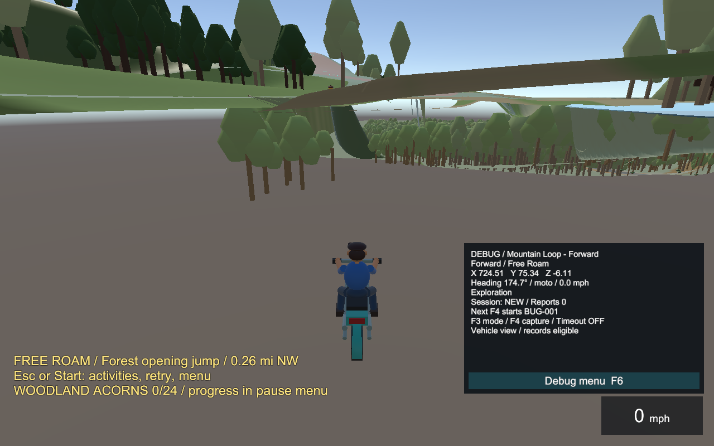
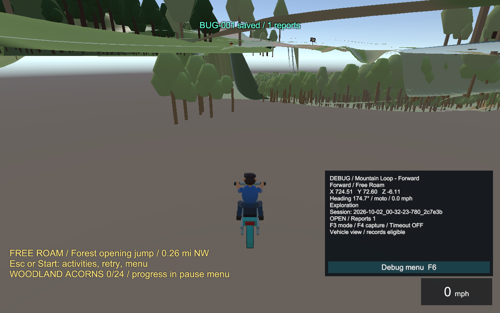

# Racer bug report

Session: 2026-10-02_00-32-23-780_2c7e3b
Started: 2026-10-02T00:32:23.7788218-04:00
Status: CLOSED
Reports: 2
Closed: 2026-10-02T00:32:25.8719148-04:00
Exported: True

## BUG-001

Comment:
> First session report one

```text
Timestamp: 2026-10-02T00:32:23.7859630-04:00
Course: Mountain Loop - Forward
Direction: Forward
Mode: Free Roam
Position: X=724.51, Y=74.93, Z=-6.11
Rotation: X=0.00, Y=174.74, Z=0.00
Heading: 174.74 degrees
Viewpoint: Vehicle
Vehicle: moto
Vehicle position: X=724.51, Y=74.93, Z=-6.11
Speed: 0.00 m/s / 0.00 mph
Lap: 0 / Next checkpoint: -1
Road progress: 2631.74 m / Branch: Main / 0.00 m
Version: 0.64.0-review1 / Build: 00000000000000000000000000000000
Scene: MountainLoop
Debug movement used: False
```



## BUG-002

Comment:
> First session report two

```text
Timestamp: 2026-10-02T00:32:24.2931086-04:00
Course: Mountain Loop - Forward
Direction: Forward
Mode: Free Roam
Position: X=724.51, Y=72.47, Z=-6.11
Rotation: X=0.00, Y=174.74, Z=0.00
Heading: 174.74 degrees
Viewpoint: Vehicle
Vehicle: moto
Vehicle position: X=724.51, Y=72.47, Z=-6.11
Speed: 0.00 m/s / 0.00 mph
Lap: 0 / Next checkpoint: -1
Road progress: 2631.89 m / Branch: Main / 0.00 m
Version: 0.64.0-review1 / Build: 00000000000000000000000000000000
Scene: MountainLoop
Debug movement used: False
```



