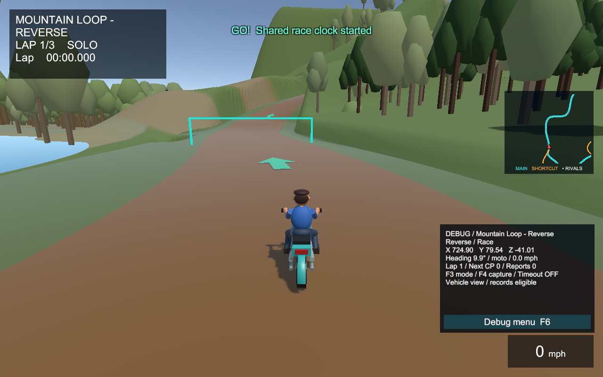
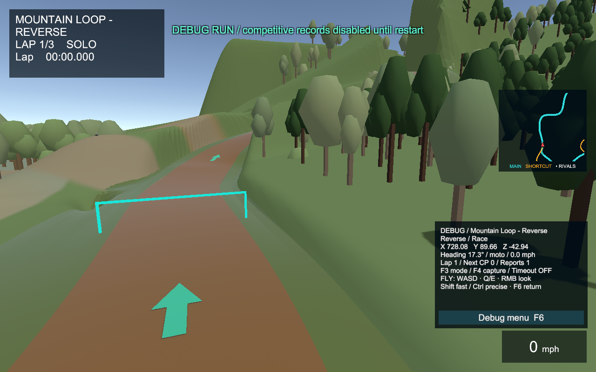
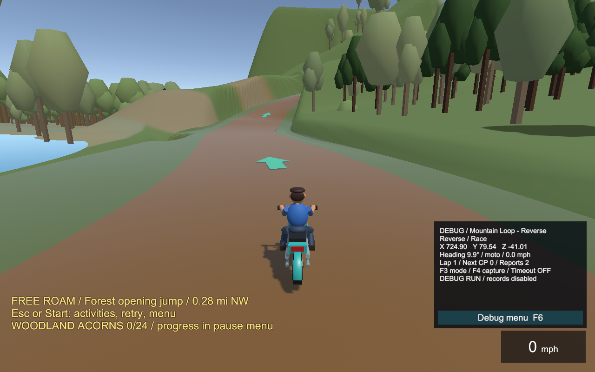

# Racer bug report

Session: 2026-10-01T18:53:46.5492729-04:00

## BUG-001

Comment:
> Road needs inspection

```text
Timestamp: 2026-10-01T18:53:46.5567898-04:00
Course: Mountain Loop - Reverse
Direction: Reverse
Mode: Race
Position: X=724.90, Y=79.54, Z=-41.01
Rotation: X=0.00, Y=9.92, Z=0.00
Heading: 9.92 degrees
Viewpoint: Vehicle
Vehicle: moto
Vehicle position: X=724.90, Y=79.54, Z=-41.01
Speed: 0.00 m/s / 0.00 mph
Lap: 1 / Next checkpoint: 0
Road progress: 19.97 m / Branch: Main / 0.00 m
Version: 0.62.0-review1 / Build: 00000000000000000000000000000000
Scene: MountainLoopReverse
Debug movement used: False
```



## BUG-002

Comment:
> Detached view: shoulder and road seam.

```text
Timestamp: 2026-10-01T18:53:47.3804748-04:00
Course: Mountain Loop - Reverse
Direction: Reverse
Mode: Race
Position: X=728.08, Y=89.66, Z=-42.94
Rotation: X=9.90, Y=17.30, Z=0.00
Heading: 17.30 degrees
Viewpoint: Detached inspection camera
Vehicle: moto
Vehicle position: X=724.90, Y=79.54, Z=-41.01
Speed: 0.00 m/s / 0.00 mph
Lap: 1 / Next checkpoint: 0
Road progress: 19.97 m / Branch: Main / 0.00 m
Version: 0.62.0-review1 / Build: 00000000000000000000000000000000
Scene: MountainLoopReverse
Debug movement used: True
```



## BUG-003

Comment:
> Free roam inspection / third report.

```text
Timestamp: 2026-10-01T18:53:47.7678922-04:00
Course: Mountain Loop - Reverse
Direction: Reverse
Mode: Free Roam
Position: X=723.78, Y=82.68, Z=-47.41
Rotation: X=13.61, Y=9.92, Z=0.00
Heading: 9.92 degrees
Viewpoint: Detached inspection camera
Vehicle: moto
Vehicle position: X=724.90, Y=79.67, Z=-41.01
Speed: 0.00 m/s / 0.00 mph
Lap: 0 / Next checkpoint: -1
Road progress: 19.97 m / Branch: Main / 0.00 m
Version: 0.62.0-review1 / Build: 00000000000000000000000000000000
Scene: MountainLoopReverse
Debug movement used: True
```



