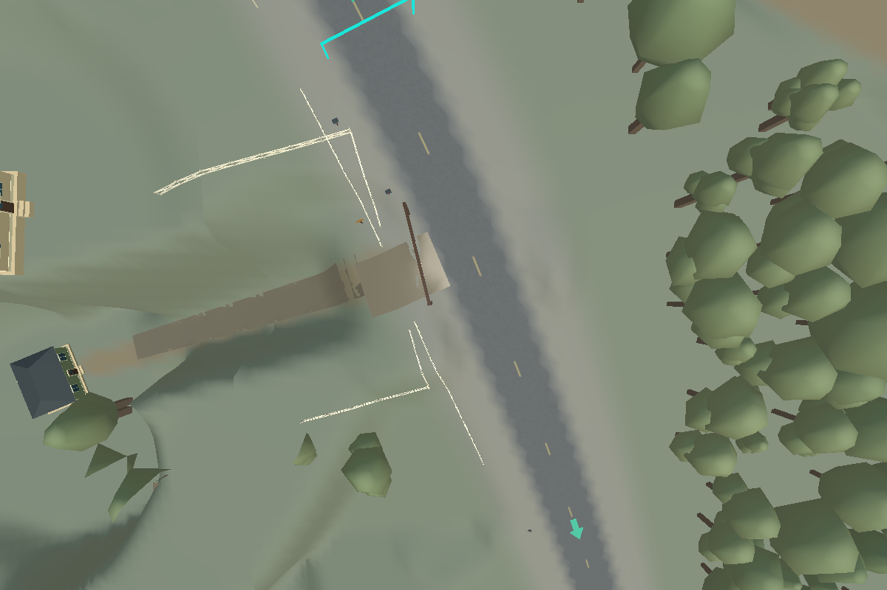
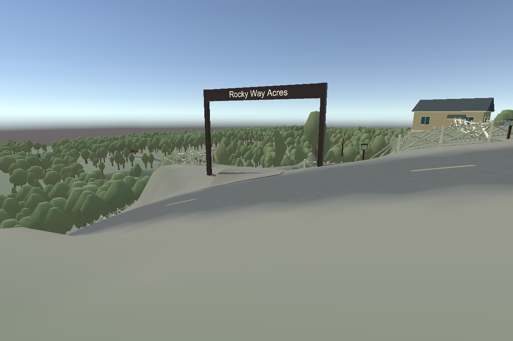

# Current McFadden / Rocky Way Acres entrance

**Street Loop — Dan's reference: X=511.6, Y=81.0, Z=-139.5.** This supersedes the obsolete sign/driveway relationship in previous property notes.

South Cherokee Lane → existing road edge → current McFadden driveway opening → driveway into House #3. The driveway alignment is preserved. Its visible road-side surface now starts at the main-road edge instead of extending over the lane.

The existing Rocky Way Acres entrance sign is now at approximately **(508.381,83.556,-134.554)** in Street Loop, immediately inside the beginning of the driveway. Grounded posts sit beside the opening, outside the main road; the original readable board spans overhead. No duplicate sign or road obstruction. Street Reverse retains its existing distinct approach, with the same sign at (508.681,83.272,-135.489).

[Targeted verification](../McFaddenEntrance/VALIDATION.md). Existing course/shortcut maps remain valid; their route geometry is unchanged. This local supplement records only the requested McFadden entrance and does not catalog unrelated landmarks.
