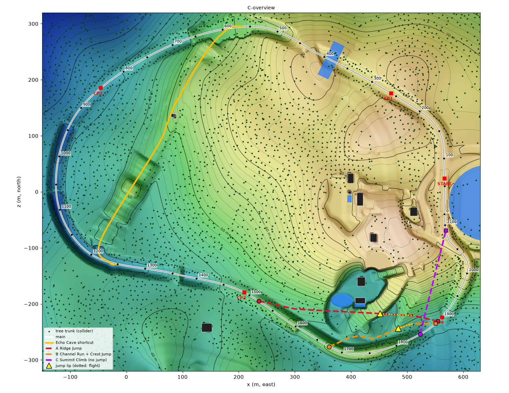
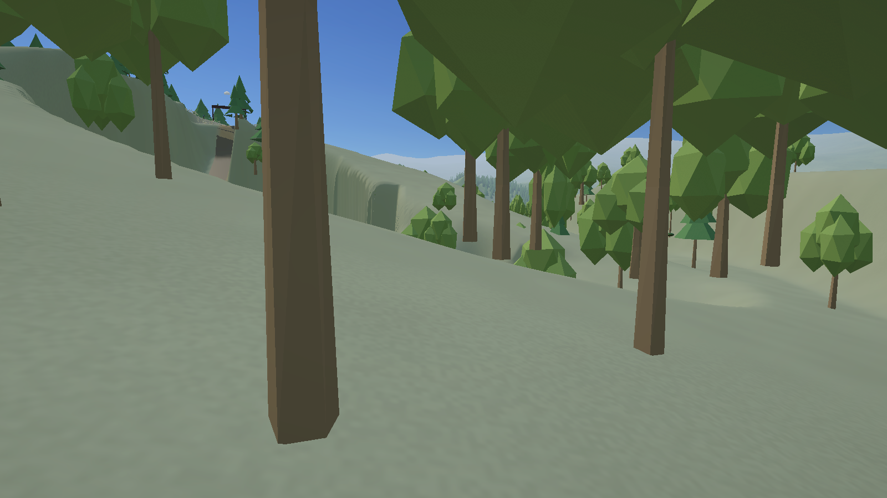
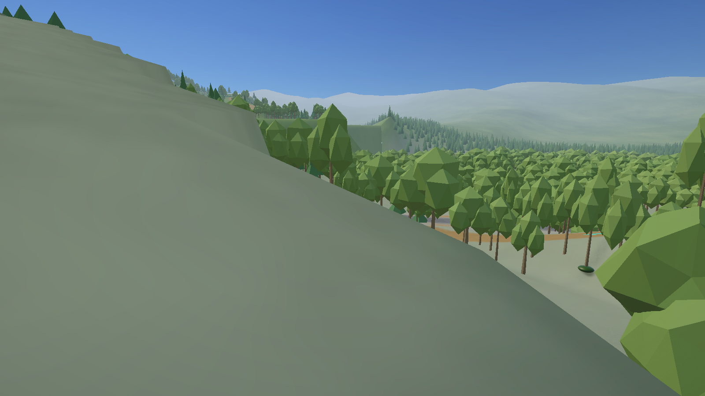
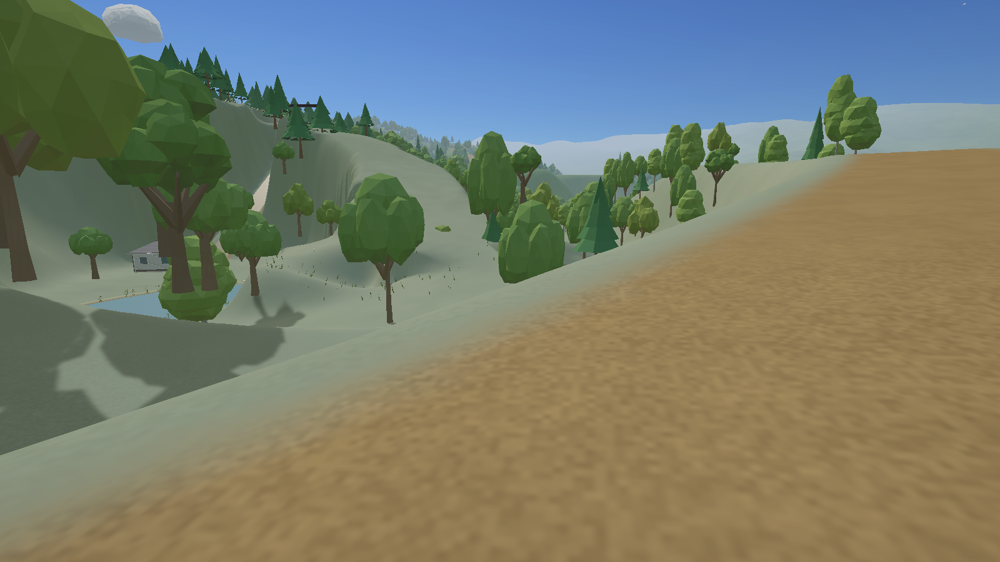
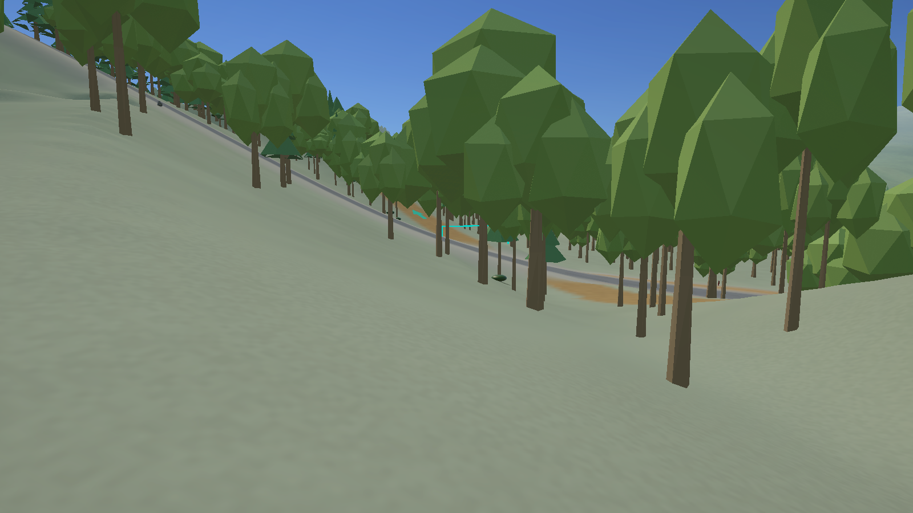
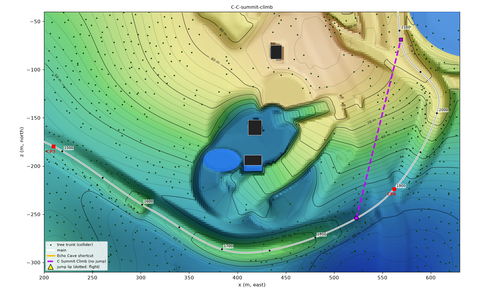
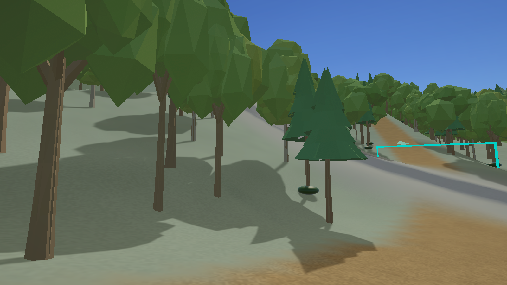
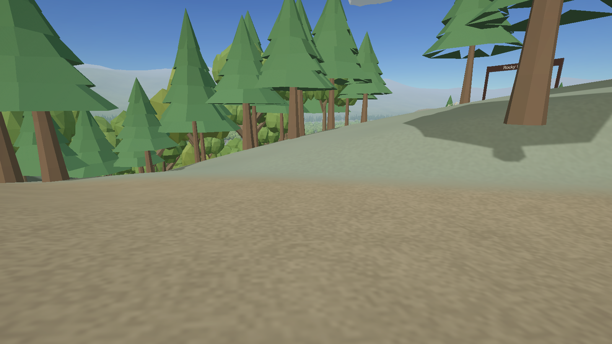

# Forest Loop Forward: options for a second shortcut (0.86 Part C)

A survey and proposal only. No scene was changed for this.

## What was measured

- **The whole lap** of `LakeWoods` (Forest Loop Forward, course `lake-v7-discovery`, 2,119 m): a 2 m height map, every tree-trunk collider, every building and every water surface.
- **Race speeds.** One autopilot lap per class, with the speed logged every physics step: Needle 600 for the bikes, Trail Four for the ATV, Street Classic for the cars. From these laps I worked out the speed each class actually holds on each grade of the main. Bikes and cars hold about 31 m/s on anything from −35 % to +45 %. The ATV holds 32–34 on the flat and drops to 19–27 on climbs. Tables: [C-lap-speeds.txt](Lists/C-lap-speeds.txt), [C-candidate-numbers.txt](Lists/C-candidate-numbers.txt).
- **Every straight line between two points of the main.** I tried every pair of points 10 m apart where the main between them runs 60–700 m. I skipped the Echo Cave stretch (stations 565–1250) and any line across the start line. That came to 5,000+ lines ([C-all-chords.tsv](Lists/C-all-chords.tsv)). For each line I recorded:
  - its length on the ground, and how much shorter it is than the main;
  - its grades;
  - any water it crosses, and the trees and buildings on it;
  - the seconds each class would save.
- **Jumps.** Each class was flown off the lip at its run-up speed, over the real ground. That shows where it comes down, on what slope, and how hard.

Tools: `Tools/Report086/Survey-ForestForward.py`, `Evaluate-Candidates.py`, `Line-Profile.py` and `Draw-Map.py`, plus the Unity probes `Report086Obstacles.cs` and `Report085Map.cs`.

## What the survey says, in one paragraph

Away from Echo Cave, the main is close to the straight line almost everywhere. The start straight, CP1, the J1 creek and the J5 stretch would all give cuts of under 25 m, worth under a second. Only two places are worth a shortcut:

1. **CP3 to CP4, round the House 3 bowl.** This is the place you pointed at. The main runs round the bowl's south rim at 45–57 m, and the bowl floor is down at 33 m. Its edges are near-vertical: 10–20 m drops and climbs at 100–280 %. The bowl is shut in to the east by the tongue of hill behind the pool and by a second hollow. Any line through it either jumps or needs ramps cut into those faces, and none is more than about 50 m shorter than the main. Best case is about 2 seconds.
2. **The hook before the finish.** After CP4 the main swings east and climbs a 37 % hill to (606, −145), then comes back north-west. Going straight up the hillside is about 40 m shorter. That is about 3 seconds for every class, because the main's own climb is slow too.

## A — Ridge Jump (CP3 to CP4, over the tongue behind the House 3 pool)

| From the bowl's south-west arm, looking east to the tongue | From the tongue's crest, looking east over the hollow |
|---|---|
|  |  |

**For the player:** Just after CP3, a gold sign points left off the main, before the Homeward Leap.

1. You run along the arm of high ground on the bowl's south-west side.
2. A ramp drops you onto the bowl floor south of the lake and the pool.
3. You charge up the hillside behind the pool to the crest of the tongue.
4. You launch east over the deep hollow.
5. You come down on the far ridge's east face and run downhill to rejoin the main just before CP4.

**Numbers:**

| | Bike | ATV | Car |
|---|---|---|---|
| Main, s 1520 → 1890 (370 m) | 11.9 s | 14.1 s | 12.2 s |
| Ridge Jump (322 m, of which 60 m in the air) | 10.2 s | 11.8 s | 10.3 s |
| **Saved** | **1.8 s** | **2.2 s*** | **1.8 s** |

\* Only if the ATV clears the jump. It does not, from the same lip as the others (below).

- **Approach speed at the lip** (at the top of a 35 % climb): bikes and cars about 31 m/s, the ATV about 23.
- **Gap:**
  - The lip is at (452, 55.5, −218).
  - The hollow below is 20 m deep, at 34–38 m.
  - The far ridge is at 40–45 m, from 45 m out.
- **Where each class comes down** (over the ground as it is now):

  | Lip | ATV at 23 m/s | Bikes and cars at 31 m/s |
  |---|---|---|
  | 8° | 41 m out, **on the rising face of the far ridge (very hard)** | 68 m out, firm landing on a −21 % slope |
  | 15° | 48 m out, firm | 86 m out, hard (near the CP4 lowland) |

  The ATV and the bikes/cars differ by 8 m/s, so no single lip suits all of them. To cover the whole spread, the landing would have to be a built downhill face 40 to 90 m out.
- **Earth moved** (roughly 5,000 m³):
  - a 25 % ramp in place of the 11 m drop into the bowl (about 2,300 m³);
  - regrading the climb up the tongue, which is now up to 57 %, to 35 % (1,000–1,500 m³);
  - a long built landing face on the far ridge (about 1,500 m³);
  - a kicker at the lip.
- **If you miss:** coming in slow (under about 29 m/s off an 8° lip, which means every ATV), you land on the rising face of the far ridge or in the 20 m hollow. That is a crash, or a long climb out along the channel. Missing costs far more than staying on the main.
- **Risks to course features (5A):**
  - The climb is cut into the hillside right behind the House 3 pool, just rebuilt in Part A. The bowl floor leg passes 7 m from the lake and about 10 m from the pool.
  - It forks before the main's J6 Homeward Leap (1540–1671). J6 stays on the main.
  - It rejoins 10 m before CP4, so racers merge right at a gate.
  - The Forest Reverse scene is not affected; this would be LakeWoods only.
- **AI:** bikes and cars could be validated. The ATV would have to stay on the main.

## B — Channel Run and Crest Jump (below the south rim to CP4)

| From the main near the fork, looking down into the channel | From the crest, looking down to CP4 |
|---|---|
|  |  |

**For the player:** Just after you land the Homeward Leap, a gold sign points left.

1. A ramp takes you down off the rim into the low channel that runs along its foot.
2. The channel is flat and fast, 35–39 m.
3. It climbs gently to a low crest at (484, −243), where a 1.5 m kicker throws you over the crest.
4. You land on the natural slope running down to CP4 and rejoin the main just before the gate.

**Numbers:**

| | Bike | ATV | Car |
|---|---|---|---|
| Main, s 1676 → 1885 (209 m) | 6.8 s | 7.8 s | 7.1 s |
| Channel and Crest Jump (200 m) | 6.4 s | 7.3 s | 6.4 s |
| **Saved** | **0.5 s** | **0.5 s** | **0.7 s** |

- **Approach speed at the kicker:** the ATV about 26 m/s, bikes and cars 31–32.
- **Where each class comes down** (10° lip, natural ground):

  | Speed | Lands | Landing |
  |---|---|---|
  | slow, 15 m/s | 15 m out | hard |
  | ATV, 26 m/s | 39 m out | firm (19°) |
  | bikes and cars, 31 m/s | 52 m out | firm (17°) |
  | very fast, 35 m/s | 61 m out | hard, where the ground starts rising toward the main |

  It works for every class at race speed, on a natural landing.
- **Earth moved** (about 1,300 m³): a 30 % ramp down the rim's inner face (about 14 m down; about 1,100 m³), smoothing one dip in the channel, and the kicker.
- **If you miss:** a slow run just lands early on the same downslope. You lose a little time and are never stuck.
- **Risks:**
  - The fork must sit after J6's landing and recovery. At s 1640 it would be inside J6.
  - It rejoins 15 m before CP4, on the outside of the main's bend.
  - Nothing else is near.
- **AI:** easy to validate for every class.
- **But:** it saves only about half a second. It is a fun alternative line, not really a shortcut.

## C — Summit Climb (cuts the hook before the finish; no jump)

| From the main at s 1850, looking up the line (CP4 ahead, right) | The top end, near the rejoin |
|---|---|
|  |  |

**For the player:** Just before CP4, a gold sign points left, straight up the wooded hillside. The main swings right through CP4 and round the long hook. You go straight up a steep, dead-straight climb through the trees and come out on the plateau to rejoin the run home 90 m before the finish line.

**Numbers:**

| | Bike | ATV | Car |
|---|---|---|---|
| Main, s 1850 → 2090 (240 m) | 9.2 s | 10.9 s | 9.5 s |
| Summit Climb (198 m) | 6.3 s | 8.0 s | 6.4 s |
| **Saved** | **2.8 s** | **2.9 s** | **3.1 s** |

- **The climb:** 48 m up over 190 m. The grades are 35–45 % for 100 m; the main's own climb is 37 %.
- **Earth moved** (600–800 m³): ease the steepest 50 m from 45 % to 38 %, and cut a trail through the forest. Three trunk colliders stand on the line itself, and about 30 drawn trees are within its width.
- **If you miss:** there is no jump. A weak car simply climbs a little slower. The Skyfin Cruiser already climbs the main's 37 %.
- **Risks:**
  - It **bypasses CP4**, which is listed as bypassed, the way Echo Cave bypasses CP2. Gates are not moved.
  - The House 3 driveway and its hilltop entrance arch are 45 m or more to the west.
  - The rejoin is on the main's last straight, 90 m before the line.
- **AI:** a straight climb, simple to validate for all classes.

## Lake or dock jumps

None is possible on this lap without very large earthworks:

- **Friend's lake.** The main runs along its west shore, and the lake lies outside the lap with no main on its far side. Any line over it is longer than the main.
- **J1 creek.** The main already jumps it at J1 Creek Crossing. The creek is a 65 × 20 m strip lying across the main, so no other main-to-main line crosses it. The best line through that stretch saves 30 m only by crossing right beside J1, which would duplicate it.
- **House 3 lake.** 0.85 measured this. The lake sits in the closed bowl with the pool 3–4 m east of it and 15–20 m cliffs beyond. A dock jump would need a pass about 20–25 m deep cut through the House 3 hill.

Of the three candidates, A passes nearest the water (7 m south of the lake). Its ramp down into the bowl could be built as a wooden boardwalk to the lakeshore, but it would not jump water.

## Also surveyed, not proposed

**D — Rim Chute and House 3 Hill** (s 1690 → 2090): drop off the south rim into the bowl's south pocket, then climb 260 m up and over the House 3 hill.

- It saves the most: **5.1 / 4.2 / 5.4 s** (bike / ATV / car), 103 m shorter.
- It cannot have a jump. Flown at any race speed, the drop comes down on the rising far side at 40–58°.
- It would need a 15 m chute plus 260 m of new trail up 30–70 % slopes, about 6,000 m³.
- It passes 4.5 m from the House 3 entrance arch.

## Ranking and what Code would build

1. **C — Summit Climb.** About 3 s for every class, the least earthwork, nothing at risk, and simple for AI. **Code would build this one** if the goal is a real second shortcut.
2. **A — Ridge Jump.** The big "ramp over the valley" jump, in the House 3 spot you pointed at. It saves about 2 s but needs the most earthwork. The ATV cannot clear the same jump as the bikes and cars, so it would ride the main.
3. **B — Channel Run and Crest Jump.** The jump that works for every vehicle, with a natural landing and little earthwork. It saves only about 0.5 s, so it is an alternative line, not a time-saver.

If the second shortcut must have a ramp, B is the one Code can make reliable for all ten vehicles. A is possible but needs a long built landing, and the ATV would stay on the main. If you want C with a jump, there is no natural drop on that hillside: a kicker there would land on flat or rising ground.
